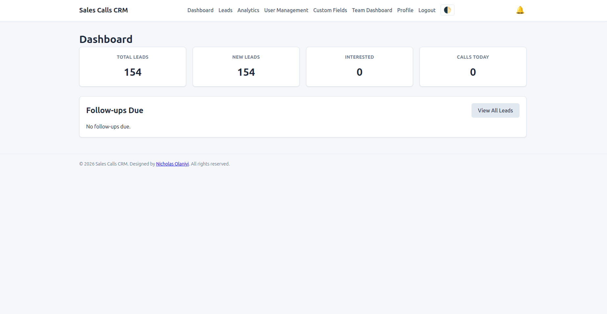
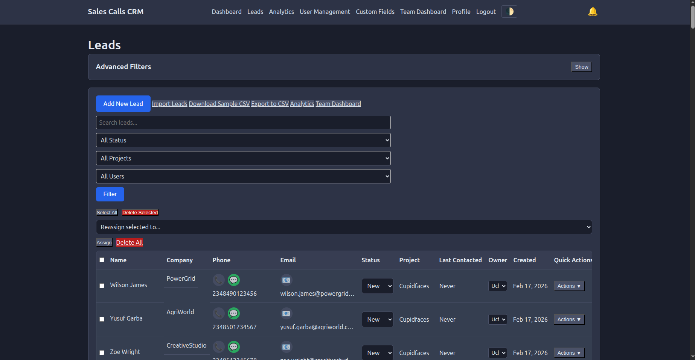
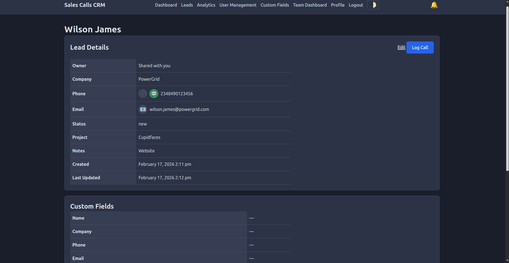
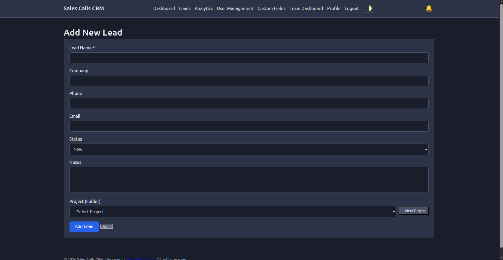
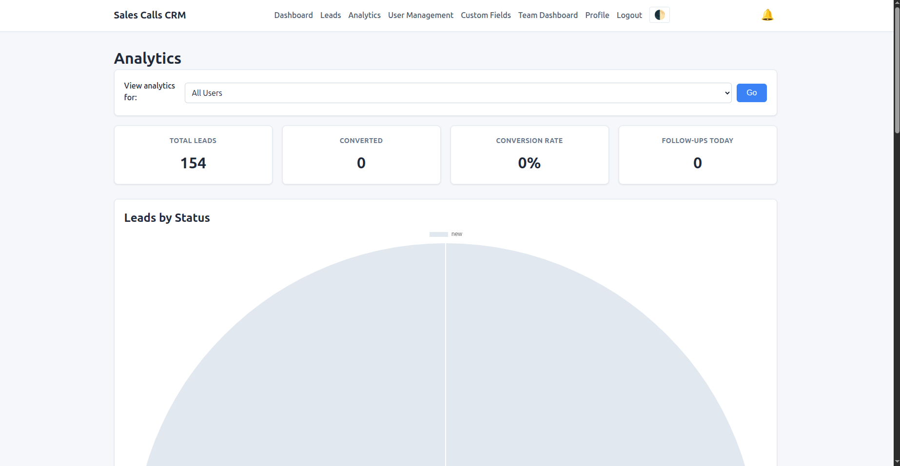
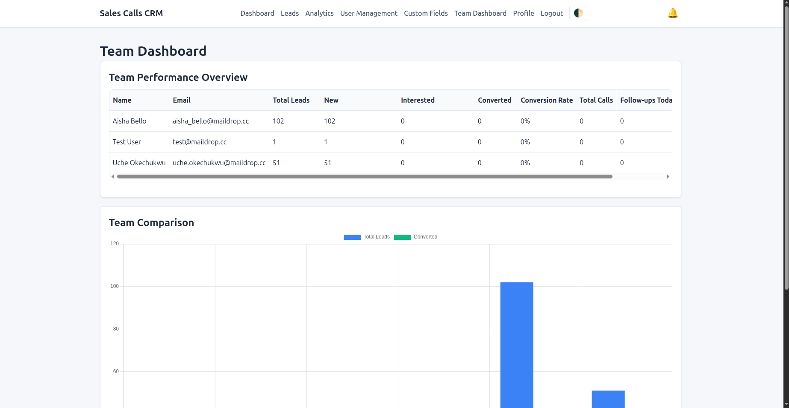
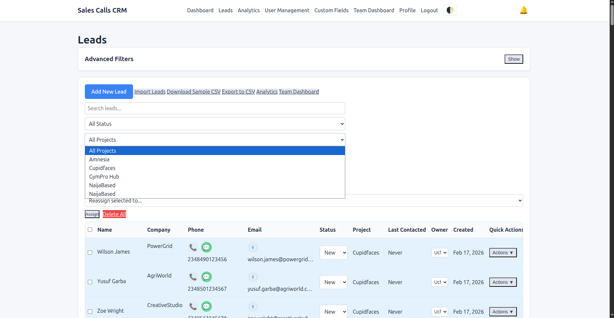
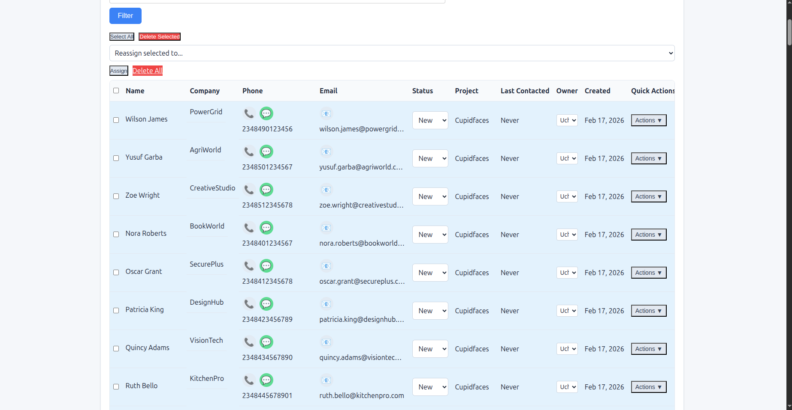
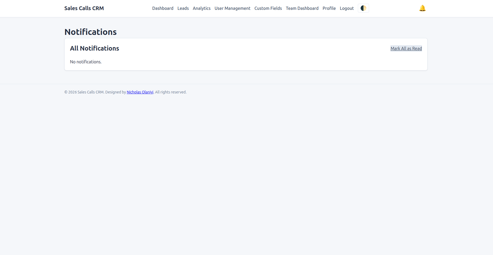

# Sales Calls CRM

A smart, lightweight CRM designed specifically for sales teams managing cold calls. Built with PHP and MySQL, it offers intuitive lead management, call tracking, and intelligent import features. Organize leads into projects, define custom fields per project, and collaborate with team members.

## Features

- **User authentication** – Secure signup/login with password hashing. Role-based access (Admin/User).
- **Projects (Folders)** – Organize leads into projects like "GYM CRM leads" or "NaijaBased Onboarding". Each project has its own set of custom columns.
- **Custom Columns per Project** – Define your own fields (text, number, date, dropdown) just like an Excel sheet. Add, edit, or delete columns anytime.
- **Lead management** – Add, edit, view, and delete leads. Search and filter by status, project, or custom fields.
- **Call logging** – Log calls with outcomes, duration (with stopwatch), and follow-up dates. Auto-calculate duration.
- **Smart import** – Upload CSV files, choose an existing project or create a new one on the fly with columns derived from CSV headers. Map columns and types during import.
- **Inline editing** – Double-click any field in the leads table to edit quickly. Status changes update instantly via AJAX.
- **Quick actions** – Dropdown menu for each lead: view details, edit, log a call, add a quick note, or delete.
- **Contact icons** – Click-to-call, WhatsApp, and copy email with one click.
- **Bulk operations** – Select multiple leads to delete in bulk, or delete all leads with confirmation (admin only).
- **Admin user management** – Admins can create, edit, or delete users and assign roles.
- **Team dashboard** – Admins see performance metrics per user: total leads, new, interested, converted, conversion rate, calls, follow-ups.
- **Notifications** – In-app notifications for follow-up reminders (with bell icon). Daily email reminders via cron.
- **Dashboard** – Overview of total leads, new leads, interested prospects, calls made today, and follow-ups due.
- **Analytics** – Visual charts for lead status distribution, calls per day, and call outcomes. Filter by user (admin).
- **Export to CSV** – Export all accessible leads with additional call info.
- **Dark mode** – Respects system preference and allows manual toggle.
- **Mobile responsive** – Works on all devices with horizontal scroll for tables.

## Tech Stack

- **Backend**: PHP (vanilla, no framework), MySQL
- **Frontend**: HTML, CSS, JavaScript (vanilla, no jQuery)
- **AJAX**: For inline updates, quick actions, and dynamic forms
- **Database**: MySQL with PDO for secure queries
- **Charts**: Chart.js for analytics

## Screenshots

Here are some screenshots of the CRM in action.

### Dashboard


### Leads List


### Lead Details


### Add/Edit Lead with Project Selection


### Import Leads – Step 2 (Mapping)


### Analytics


### Team Dashboard (Admin)


### Project Management


### Custom Columns per Project


### Notifications


### Dark Mode


## Installation

### Local Development

1. Clone the repository:
   ```bash
   git clone https://github.com/nick-laniyi/salescall-crm.git
   cd salescalls-crm
Set up a local web server (Apache/Nginx) pointing to the project folder. Ensure mod_rewrite is enabled if you plan to use clean URLs later.

Create a MySQL database and run the SQL from database/schema.sql. The full schema includes:

Users table (with role column)

Leads table (with project_id)

Calls table

Lead_shares table

Projects table

Project_columns table

Lead_column_values table

Notifications table

Copy includes/config.example.php to includes/config.php and fill in your database credentials.

Set the document root to the project folder (or configure your virtual host). For example, with Apache:

apache
<VirtualHost *:80>
    ServerName salescalls.local
    DocumentRoot /path/to/salescalls-crm
</VirtualHost>

Create a temp_uploads directory in the project root with write permissions:

bash
mkdir temp_uploads
chmod 777 temp_uploads

Access the CRM at http://salescalls.local and register a new user. The first user will be a regular user; to make yourself admin, manually update the role column in the users table to 'admin'.

Production Deployment
Upload all files to your web server.

Create a MySQL database and user.

Update includes/config.php with production credentials.

Run the schema SQL to create tables.

Create a temp_uploads directory with write permissions (e.g., 755 or 777 depending on server).

Set up a cron job for daily follow-up emails and notifications:


0 8 * * * /usr/bin/php /path/to/salescalls-crm/cron/send-reminders.php


File Structure


salescalls-crm/
├── admin/
│   ├── projects.php
│   ├── project_form.php
│   ├── project_columns.php
│   ├── project_column_form.php
│   ├── project_column_save.php
│   ├── users.php
│   ├── user-form.php
│   └── team.php
├── assets/
│   ├── css/
│   │   └── style.css
│   └── js/
│       ├── script.js
│       └── clipboard.js
├── cron/
│   └── send-reminders.php
├── includes/
│   ├── auth.php
│   ├── config.example.php
│   ├── config.php (ignored by git)
│   ├── footer.php
│   ├── functions.php
│   └── header.php
├── temp_uploads/ (ignored by git)
├── .gitignore
├── dashboard.php
├── download_sample.php
├── export.php
├── get_notifications.php
├── get_project_columns.php
├── import.php
├── index.php
├── lead.php
├── leads.php
├── log-call.php
├── login.php
├── logout.php
├── mark_notifications.php
├── notifications.php
├── profile.php
├── quick_create_project.php
├── quick-status.php
├── register.php
└── README.md

Configuration
Database: Edit includes/config.php with your DB details.

Email: For follow-up reminders, configure your server's mail() or use SMTP in cron/send-reminders.php. The script also creates in-app notifications.

Contributing
Contributions are welcome! Feel free to open issues or submit pull requests. Please follow existing code style and include tests where applicable.

License
This project is open source and available under the MIT License.

Acknowledgements
Built as a portfolio project to demonstrate full-stack PHP development, AJAX interactions, and smart data handling. Designed by Nicholas Olaniyi.