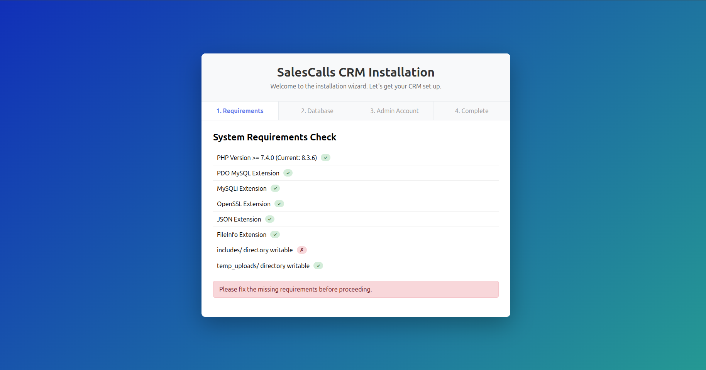
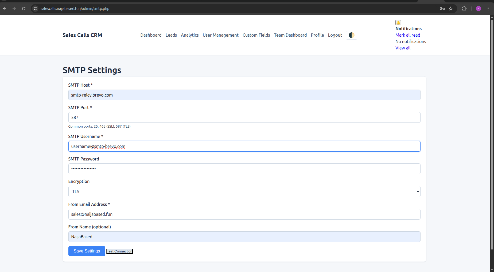
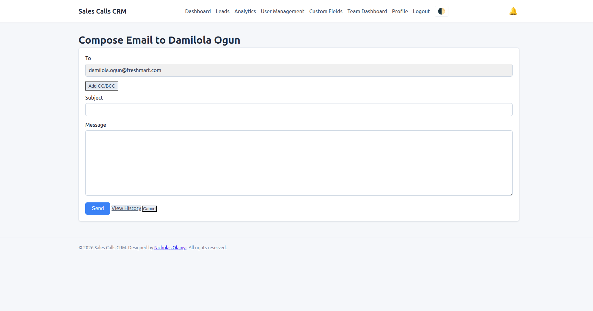

Updated README.md
markdown
# SalesCalls CRM

A smart, lightweight CRM designed specifically for sales teams managing cold calls. Built with PHP and MySQL, it offers intuitive lead management, call tracking, email integration, and intelligent import features. Organize leads into projects, define custom fields per project, collaborate with team members, and track all communications.


##  Features

### Core Features
- **User Authentication** – Secure signup/login with password hashing. Role-based access (Admin/User). First-login setup wizard forces password change.
- **Projects (Folders)** – Organize leads into projects like "Q1 Campaign" or "Enterprise Clients". Each project has its own set of custom columns.
- **Custom Columns per Project** – Define your own fields (text, email, phone, number, date, dropdown) just like a spreadsheet. Add, edit, or delete columns anytime.
- **Lead Management** – Add, edit, view, and delete leads. Search and filter by status, project, date range, or custom fields.
- **Inline Editing** – Double-click any field in the leads table to edit instantly. Status changes update via AJAX without page reload.

### Call Tracking
- **Call Logging** – Log calls with outcomes (No Answer, Left Message, Interested, Not Interested, Callback, Converted).
- **Call Timer** – Built-in stopwatch to track call duration automatically.
- **Follow-up Dates** – Set follow-up dates with in-app notifications and email reminders.
- **Call History** – View complete call history for each lead with notes and outcomes.

### Email Integration
- **Send Emails** – Compose and send emails directly from lead view or leads list.
- **CC/BCC Support** – Optional CC and BCC fields when composing.
- **Email History** – Track all sent emails with status (sent/failed) and full content.
- **SMTP Configuration** – Admin panel to configure SMTP settings (supports Gmail, Brevo, SendGrid, etc.).
- **Email Templates** – View sent email content in a clean modal.

### Smart Import
- **CSV Import** – Upload CSV files, create new projects on the fly from CSV headers.
- **Column Mapping** – Map CSV columns to project fields during import.
- **Validation** – Skip invalid rows with clear error reporting.

### Team Collaboration
- **Lead Sharing** – Share leads with other users (view or edit permissions).
- **Team Dashboard** – Admins see performance metrics per user: total leads, calls, conversion rates.
- **User Management** – Admins can create, edit, or delete team members.

### Notifications
- **In-App Notifications** – Bell icon shows follow-up reminders and system alerts.
- **Email Reminders** – Daily cron job sends follow-up reminders via email.
- **Read/Unread** – Mark notifications as read, view all in dedicated page.

### Analytics & Reporting
- **Dashboard Charts** – Visual overview of lead status distribution, calls per day.
- **Conversion Tracking** – Track lead progression through sales funnel.
- **Export to CSV** – Export all leads with custom fields and call data.

### User Experience
- **Dark Mode** – Respects system preference with manual toggle.
- **Mobile Responsive** – Works on all devices with card-based mobile view.
- **Quick Actions** – One-click call, WhatsApp, email, and copy buttons.
- **Bulk Operations** – Select multiple leads to delete or reassign (admin only).

## 🛠 Tech Stack

- **Backend**: PHP 7.4+ (vanilla, no framework), MySQL 5.7+
- **Frontend**: HTML5, CSS3, JavaScript (vanilla, no jQuery)
- **AJAX**: For inline updates, quick actions, and dynamic forms
- **Email**: PHPMailer with SMTP support
- **Charts**: Chart.js for analytics
- **Security**: Password hashing (bcrypt), PDO prepared statements, CSRF protection

## Screenshots

| Installation | SMTP Settings |
|:---:|:---:|
|  |  |

| Dashboard | Leads List |
|:---:|:---:|
|  |  |

| Lead Details | Add/Edit Lead |
|:---:|:---:|
|  |  |

| Import Leads | Analytics |
|:---:|:---:|
|  |  |

| Team Dashboard | Projects |
|:---:|:---:|
|  |  |

| Custom Columns | Notifications |
|:---:|:---:|
|  |  |

| Email Compose | Dark Mode |
|:---:|:---:|
|  |  |

##  Installation

### Quick Install (Recommended)
1. Upload all files to your web server
2. Navigate to `https://yourdomain.com/install.php`
3. Follow the 4-step installation wizard:
   - ✅ System requirements check
   - ✅ Database configuration
   - ✅ Create admin account
   - ✅ Installation complete
4. Login with your admin credentials
5. Complete the first-login setup to change your password
6. Start using your CRM!

### Manual Installation
1. Clone the repository:
   ```bash
   git clone https://github.com/nick-laniyi/salescall-crm.git
   cd salescalls-crm
Create a MySQL database and import the schema:

bash
mysql -u username -p database_name < database/schema.sql
Create includes/config.php from example:

bash
cp includes/config.example.php includes/config.php
Edit includes/config.php with your database credentials.

Set proper permissions:

bash
chmod 755 temp_uploads
chmod 644 includes/config.php
Create default admin user (or use installer):

sql
INSERT INTO users (name, email, password_hash, role, setup_completed) 
VALUES ('Administrator', 'admin@example.com', '$2y$10$YourHashedPassword', 'admin', 0);
Configure your web server to point to the project root.

Set up cron job for daily reminders:

bash
0 8 * * * /usr/bin/php /path/to/salescalls-crm/cron/send-reminders.php

📁 File Structure
text
salescalls-crm/
├── admin/                    # Admin-only pages
│   ├── projects.php          # Project management
│   ├── project_columns.php   # Custom columns per project
│   ├── smtp.php              # SMTP configuration
│   ├── team.php              # Team dashboard
│   └── users.php             # User management
├── assets/
│   ├── css/
│   │   └── style.css         # Main stylesheet (dark mode support)
│   └── js/
│       ├── script.js         # Main JavaScript
│       └── clipboard.js      # Copy to clipboard helper
├── cron/
│   └── send-reminders.php    # Daily reminder script
├── database/
│   └── schema.sql            # Complete database schema
├── email/
│   ├── compose.php           # Email composition
│   └── history.php           # Email history view
├── includes/
│   ├── auth.php              # Authentication functions
│   ├── config.example.php    # Example configuration
│   ├── config.php            # Your configuration (created by installer)
│   ├── email_config.php      # SMTP settings (auto-generated)
│   ├── footer.php            # Global footer
│   ├── functions.php         # Core functions
│   └── header.php            # Global header
├── phpmailer/                # PHPMailer library
├── screenshots/              # Documentation images
├── temp_uploads/             # Temporary CSV uploads
├── user/                     # User-accessible pages
│   ├── projects.php          # User project management
│   └── project_columns.php   # User column management
├── .gitignore
├── .htaccess                 # Apache configuration
├── install.php               # Installation wizard
├── setup.php                 # First-login setup
├── login.php                 # User login
├── register.php              # User registration
├── dashboard.php             # Main dashboard
├── leads.php                 # Leads list with inline editing
├── lead.php                  # Lead details view/edit
├── log-call.php              # Call logging
├── ajax_log_call.php         # AJAX endpoint for calls
├── quick-status.php          # AJAX inline updates
├── import.php                # CSV import
├── export.php                # CSV export
├── analytics.php             # Analytics charts
├── notifications.php         # Notification center
├── profile.php               # User profile
└── README.md


Configuration
Database
The installer creates includes/config.php with your database credentials:

php
define('DB_HOST', 'localhost');
define('DB_NAME', 'salescrm');
define('DB_USER', 'username');
define('DB_PASS', 'password');
Email (SMTP)
Configure email settings in Admin → SMTP Settings:

SMTP Host (e.g., smtp.gmail.com, smtp-relay.brevo.com)

Port (587 for TLS, 465 for SSL)

Username/Password

From Email/Name

Cron Jobs
Set up daily reminders:

bash
# Send follow-up reminders at 8 AM daily
0 8 * * * /usr/bin/php /var/www/salescalls-crm/cron/send-reminders.php
User Roles
Admin
Full system access

Create/edit/delete users

View team dashboard

Configure SMTP

Delete all leads

Reassign leads

Manage all projects

User
Manage assigned leads

Log calls and send emails

Create personal projects

View shared leads

Receive notifications


Contributing
Contributions are welcome! Please follow these guidelines:

Fork the repository

Create a feature branch (git checkout -b feature/AmazingFeature)

Commit your changes (git commit -m 'Add some AmazingFeature')

Push to the branch (git push origin feature/AmazingFeature)

Open a Pull Request

Coding Standards
Follow existing code style (4 spaces for indentation)

Use PDO for all database queries (no raw mysqli)

Escape all output with htmlspecialchars()

Add comments for complex logic

Test dark mode compatibility

📝 License
This project is open source and available under the MIT License.


Acknowledgements
Built as a portfolio project by Nicholas Olaniyi

Icons and emoji for intuitive UI

Chart.js for beautiful analytics

PHPMailer for reliable email delivery

Inspired by real sales team workflows

Contact
For questions or feedback:

GitHub: https://github.com/nick-laniyi

Email: nicklaniyi@gmail.com

LinkedIn: https://www.linkedin.com/in/nicklaniyi

⭐ Star this repo if you find it useful!